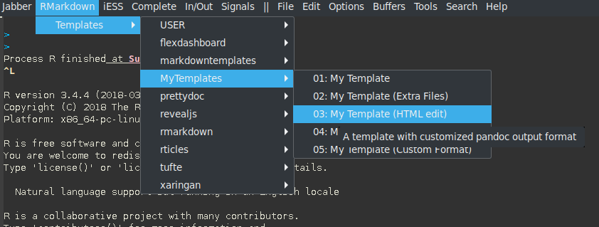

  <!--  -->
  
  
  

Polymodes for the R language:

  - `poly-noweb+R-mode`
  - `poly-markdown+R-mode`
  - `poly-rapport-mode`
  - `poly-html+R-mode`
  - `poly-brew+R-mode`
  - `poly-R+C++-mode`
  - `poly-C++R-mode`
  - `poly-ess-help+R-mode`
  - `poly-Rd-mode`

Weavers:

  - `knitr`
  - `knitr-ESS`
  - `Sweave-ESS
  - `Sweave`

Exporters:

  - `Rmarkdown`
  - `Rmarkdown-ESS`
  - `Rbookdown-ESS`

RMarkdown templates available through ESS menus and on `M-n M-m` in Rmd files (`poly-r-rmarkdown-create-from-template`):

  
